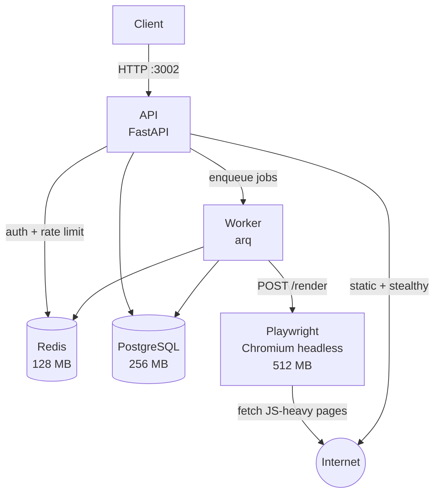

# ScrapeForge

Self-hosted web data API powered by [Scrapling](https://github.com/D4Vinci/Scrapling). Drop-in replacement for Firecrawl OSS — one `docker compose up` on a 4 GB VPS and you have a production scraping API.

**Total RAM footprint: ≤ 1.5 GB**

## Architecture



### Fetch strategy (Scrapling fallback chain)

```
Static (Scrapling Fetcher) → Stealthy (StealthyFetcher, Cloudflare bypass) → Playwright (JS SPA)
```

Playwright is only used as a last resort, keeping RAM usage low.

---

## System Requirements

| Resource | Minimum |
|----------|---------|
| RAM | 4 GB (2 GB usable for host OS + stack) |
| CPU | 1 vCPU |
| Disk | 10 GB |
| Docker | 24+ |
| Docker Compose | v2 |

---

## Quickstart (< 5 minutes)

```bash
# 1. Clone
git clone https://github.com/jossman14/firecrawl.git scrapeforge
cd scrapeforge

# 2. Configure
cp .env.example .env

# Set a strong API key secret — REQUIRED before creating any API keys
python3 -c "import secrets; print('KEY_HASH_SECRET=' + secrets.token_hex(32))" >> .env

# Set admin dashboard password
echo 'ADMIN_KEY=change_me_to_a_strong_password' >> .env

# 3. Start
make up

# 4. Wait for healthy (takes ~30s on first run for DB init)
docker compose ps

# 5. Create your first API key via admin dashboard
open http://localhost:3002/admin    # login with ADMIN_KEY from .env
# Or use the API directly after creating a key:

# 6. First API call
curl -X POST http://localhost:3002/v1/scrape \
  -H "Authorization: Bearer sf_<your_key>" \
  -H "Content-Type: application/json" \
  -d '{"url": "https://example.com"}'
```

---

## Make Commands

| Command | Description |
|---------|-------------|
| `make up` | Start all services in background |
| `make down` | Stop all services |
| `make test` | Run test suite |
| `make logs` | Follow all service logs |
| `make build` | Rebuild all images (no cache) |

---

## Service Overview

| Service | Image | RAM Limit | Port | Purpose |
|---------|-------|-----------|------|---------|
| `api` | scrapeforge-api | 256 MB | 3002 (external) | FastAPI HTTP entry point |
| `worker` | scrapeforge-worker | 256 MB | — | Async job processor (arq) |
| `playwright` | scrapeforge-playwright | 512 MB | internal | Headless Chromium for JS-heavy pages |
| `redis` | redis:7-alpine | 128 MB | internal | Job queue, cache, rate-limit counters |
| `postgres` | postgres:16-alpine | 256 MB | internal | Jobs, results, API keys, audit log |

**Total: ≤ 1.5 GB RAM**

---

## API Endpoints

| Method | Path | Auth | Description |
|--------|------|------|-------------|
| POST | `/v1/scrape` | Key | Scrape a single URL (synchronous) |
| POST | `/v1/crawl` | Key | Recursive crawl from seed URL (async) |
| POST | `/v1/map` | Key | Discover all URLs on a site |
| POST | `/v1/extract` | Key | LLM-powered structured data extraction |
| POST | `/v1/batch/scrape` | Key | Scrape multiple URLs concurrently (async) |
| GET | `/v1/jobs/{id}` | Key | Get job status + results |
| GET | `/health` | None | Liveness probe |
| GET | `/ready` | None | Readiness probe (checks DB + Redis) |
| GET | `/metrics` | None | Prometheus metrics |

See [`docs/API.md`](docs/API.md) for full request/response schemas and examples.

---

## Configuration Reference

All configuration is via environment variables. Copy `.env.example` to `.env` and edit before first run.

| Variable | Required | Default | Description |
|----------|----------|---------|-------------|
| `PORT` | No | `3002` | API listen port |
| `HOST` | No | `0.0.0.0` | API bind address |
| `REDIS_URL` | Yes | `redis://redis:6379/0` | Redis connection string |
| `DATABASE_URL` | Yes | `postgresql+asyncpg://...` | PostgreSQL async connection string |
| `PLAYWRIGHT_URL` | No | `http://playwright:3000/render` | Playwright service endpoint |
| `KEY_HASH_SECRET` | **Yes** | *(none)* | HMAC-SHA256 secret for API key hashing. Generate: `python3 -c "import secrets; print(secrets.token_hex(32))"`. **Must be set before creating keys.** |
| `ADMIN_KEY` | **Yes** | *(none)* | Admin dashboard password. Use a strong random string. |
| `PROXY_SERVER` | No | *(empty)* | HTTP proxy for outbound requests (e.g. `http://proxy:8080`) |
| `LLM_API_KEY` | No | *(empty)* | OpenAI-compatible API key. Required for `/v1/extract`. |
| `LLM_BASE_URL` | No | `https://api.openai.com/v1` | LLM API base URL (use Ollama URL for local models) |
| `LLM_MODEL` | No | `gpt-4o-mini` | Model name for LLM extraction |
| `LOG_LEVEL` | No | `INFO` | Logging verbosity (`DEBUG`, `INFO`, `WARNING`, `ERROR`) |
| `WORKERS` | No | `2` | Number of API worker processes |

### Using Ollama for local LLM

```bash
# In .env
LLM_API_KEY=ollama
LLM_BASE_URL=http://host.docker.internal:11434/v1
LLM_MODEL=llama3
```

---

## 10 MVP Features

1. **POST /v1/scrape** — Single URL → markdown/html/json/screenshot/links
2. **POST /v1/crawl** — Recursive BFS crawl with depth/path controls
3. **POST /v1/map** — Fast URL discovery (sitemap + link extraction)
4. **POST /v1/extract** — Structured JSON extraction via LLM + JSON Schema
5. **POST /v1/batch/scrape** — Concurrent multi-URL scraping
6. **Async job system** — `GET /v1/jobs/{id}` for status + partial results
7. **Adaptive self-healing scraping** — Scrapling selectors survive DOM changes; 3-tier fallback (static → stealthy → browser)
8. **Stealth & anti-bot** — StealthyFetcher, Cloudflare bypass, optional proxy rotation
9. **Caching + dedup + rate limiting** — Redis cache (configurable TTL), URL dedup in crawl frontier, per-key sliding-window rate limit
10. **Auth + Admin + Observability** — API key auth, admin dashboard, `/health`, `/ready`, `/metrics`

---

## Security Notes

- `KEY_HASH_SECRET` **must** be set to a random 32-byte hex string before creating API keys. Changing it later invalidates all existing keys.
- `ADMIN_KEY` should be a strong random string. The admin dashboard is not rate-limited, so restrict network access in production.
- All outbound requests are SSRF-protected (blocks private IPs and cloud metadata endpoints).
- API keys are stored as HMAC-SHA256 hashes; plaintext keys are never persisted.
- For production: add a reverse proxy (nginx/Caddy) with HTTPS in front of port 3002.

---

## Docs

- [`docs/API.md`](docs/API.md) — Full API reference with request/response schemas
- [`docs/RESEARCH.md`](docs/RESEARCH.md) — Scrapling vs alternatives comparison matrix
- [`docs/ADR/`](docs/ADR/) — Architecture decision records
