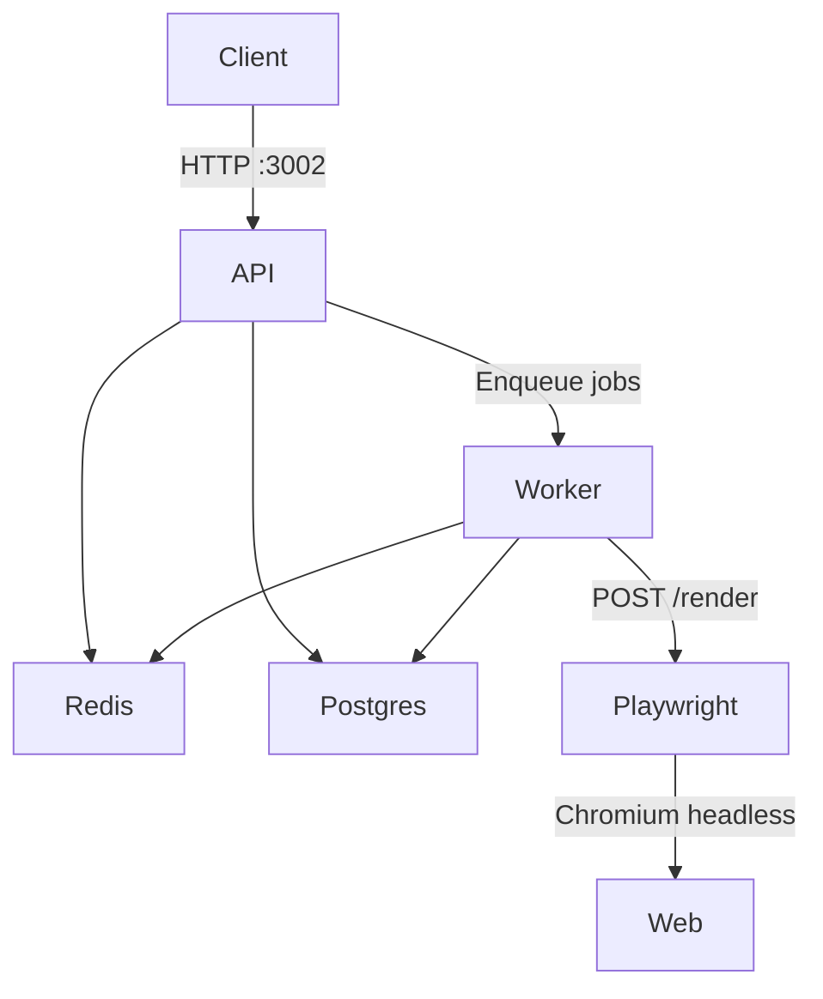

# ScrapeForge

A modular web scraping API built for low-RAM VPS deployment (target: ≤ 1.5 GB total stack).

## Architecture



## Quick Start

```bash
cp .env.example .env
# Edit .env with your values
make up
```

## Commands

| Command | Description |
|---------|-------------|
| `make up` | Start all services in background |
| `make down` | Stop all services |
| `make test` | Run test suite |
| `make logs` | Follow all service logs |
| `make build` | Rebuild all images (no cache) |

## Services

| Service | Image | RAM Limit | Port |
|---------|-------|-----------|------|
| api | scrapeforge-api | 256 MB | 3002 (external) |
| worker | scrapeforge-worker | 256 MB | — |
| playwright | scrapeforge-playwright | 512 MB | internal only |
| redis | redis:7-alpine | 128 MB | internal only |
| postgres | postgres:16-alpine | 256 MB | internal only |

**Total target footprint: ≤ 1.5 GB RAM**

## API Endpoints

- `GET /health` — Liveness check
- `GET /ready` — Readiness check (verifies DB + Redis connectivity)

## Environment Variables

See `.env.example` for all configuration options.
